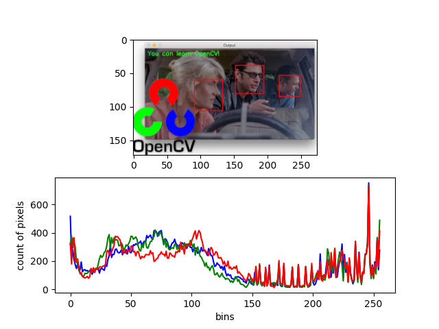
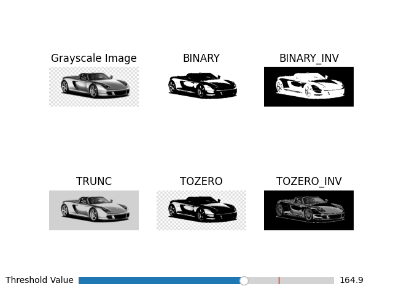
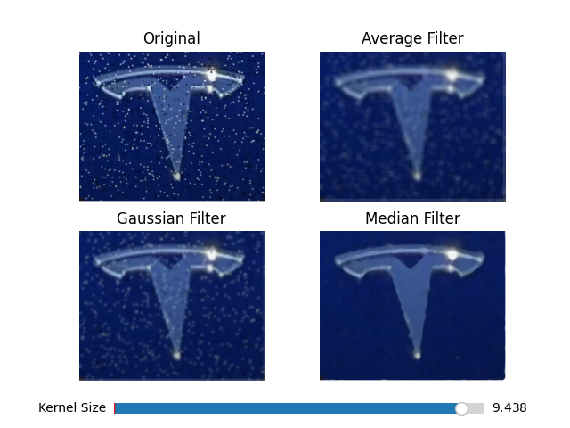
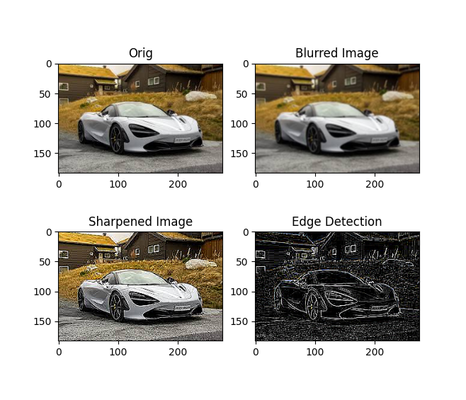
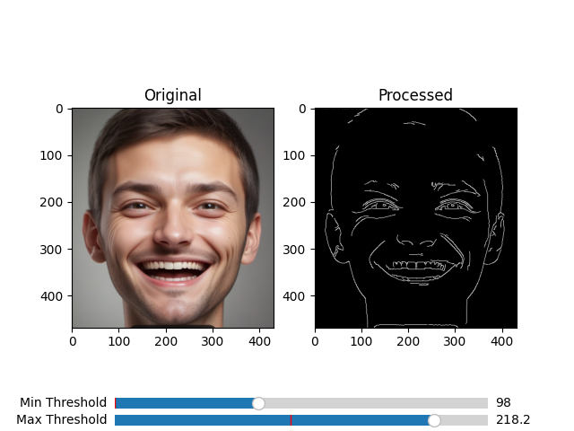
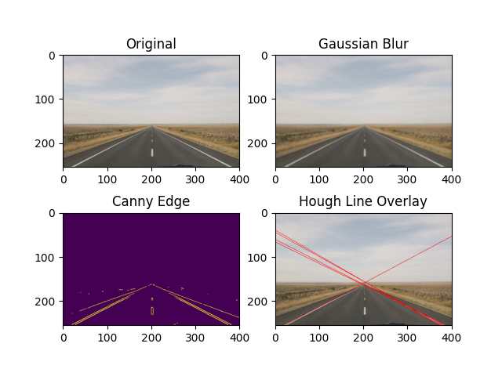
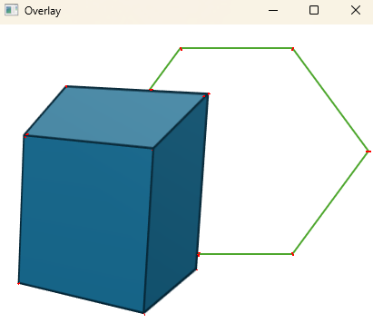

# opencv-tutorial
OpenCV Beginner Tutorials and Code.

# Purpose
This repository will be used for: 
  1. Ramping up on OpenCV up to LLM
  2. For sharing with potential learners like myself
  3. Familiarize with gitHub repo

# Sources
Here are a few sources that I used as references for this repo
  - Kevin Wood: https://www.youtube.com/watch?v=TMqH2fYhxh0
  - OpenCV: https://docs.opencv.org/4.x/d9/df8/tutorial_root.html#

#  Images
## 1. Histogram Demo

## 2. Threshold Demo Results

## 3. Filter Demo

## 4. Convolution Demo

## 5. Canny Edge Demo

## 6. Hough Line 

## 7. Harris Corner Detection
